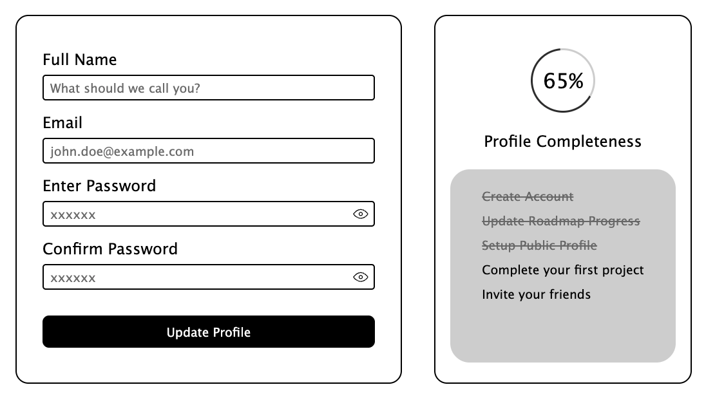

# Accessible Form UI

A static, accessible profile-update form built with only **HTML and CSS**. It includes fields for full name, email, password and confirm password (with show/hide buttons), plus a profile completeness tracker with a checklist of tasks.

## Preview



## Overview

This project is based on the [Accessible Form UI](https://roadmap.sh/projects/accessible-form-ui) challenge from roadmap.sh.

The goal of this project is to practice HTML and CSS while focusing on building a form that is easy to use for everyone, including people who rely on keyboards and assistive technologies. This version is a static UI with no JavaScript, so it can be enhanced later with validation and interactivity.

## Features

- Form with **Full Name**, **Email**, **Password** and **Confirm Password** fields
- Show/hide password buttons for both password fields
- Error message placeholders for each field, revealed with the CSS `:user-invalid` pseudo-class
- Circular **profile completeness** indicator (65%) drawn with a `conic-gradient`
- Task checklist where completed tasks are greyed out and struck through
- Visible focus state on every input

## Accessibility Considerations

- Every input has a `<label>` linked through `for` and `id`
- Required fields use `required` and `aria-required="true"`
- Invalid fields are highlighted with a red border and a visible error message, so state isn't communicated by colour alone
- Thicker border on `:focus` so keyboard users can see the active field
- Show/hide buttons are real `<button type="button">` elements, keyboard focusable, with `aria-label` and `aria-controls`
- Semantic structure using `<main>`, `<form>`, `<label>` and `<button>`
- Large, readable font sizes and high-contrast black-on-white styling
- Legacy browser password reveal icon (`::-ms-reveal`) hidden to avoid duplicate controls

## Tech Stack

- HTML5
- CSS3 (Flexbox, `conic-gradient`, `:user-invalid`, `:nth-of-type`)

## Project Structure

```
.
├── index.html
├── style.css
├── images/
│   ├── eye-icon.svg
│   └── preview.png
└── README.md
```

## Getting Started

1. Clone the repository
   ```bash
   git clone https://github.com/KunalGuhagarkar/Accessible-Form-UI.git
   ```
2. Open the project folder
   ```bash
   cd Accessible-Form-UI
   ```
3. Open `index.html` in your browser (or use a tool like VS Code Live Server)

## Testing Accessibility

Check the form with:

- Keyboard only (Tab, Shift+Tab, Enter, Space)
- A screen reader (NVDA, VoiceOver, JAWS)
- Browser tools such as [Axe DevTools](https://www.deque.com/axe/) or Chrome Lighthouse

## Author

**Kunal Guhagarkar**
- GitHub: [@KunalGuhagarkar](https://github.com/KunalGuhagarkar)